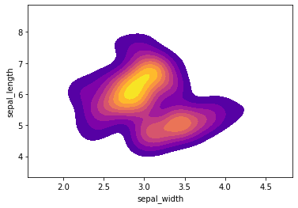

# SVM (Support Vector Machine) Project. 

In this project I will be using the famous [iris data set](http://en.wikipedia.org/wiki/Iris_flower_data_set).

The Iris floral data set or Fisher's Iris data set is a multivariate data set introduced by Sir Ronald Fisher in 1936 as an example of discriminant analysis.

The data set consists of 50 samples of each of the three species of iris (Iris setosa, Iris virginica and Iris versicolor), so that 150 samples total. Four characteristics of each sample were measured: the length and width of the sepals and petals, in centimeters.

Here is an image of the three different types of iris:


```python
# Iris Setosa
from IPython.display import Image
url = 'http://upload.wikimedia.org/wikipedia/commons/5/56/Kosaciec_szczecinkowaty_Iris_setosa.jpg'
Image(url,width=300, height=300)
```


```python
# Iris Versicolor
from IPython.display import Image
url = 'http://upload.wikimedia.org/wikipedia/commons/4/41/Iris_versicolor_3.jpg'
Image(url,width=300, height=300)
```


```python
# Iris Virginica
from IPython.display import Image
url = 'http://upload.wikimedia.org/wikipedia/commons/9/9f/Iris_virginica.jpg'
Image(url,width=300, height=300)
```


The iris dataset contains measurements of 150 iris flowers from three different species.
As três classes no conjunto de dados Iris:

     Iris-setosa (n = 50)
     Iris-versicolor (n = 50)
     Iris-virginica (n = 50)

The four features of the Iris dataset:

     sepal length in cm
     sepal width in cm
     petal length in cm
     petal width in cm


```python
# Import libraries to use.
import numpy as np
import pandas as pd
import seaborn as sns
import matplotlib.pyplot as plt
%matplotlib inline
```


```python
# Import data into a dataset
iris = sns.load_dataset('iris')
```


```python
# Overview data with .head() method.
iris.head()
```


<div>
<style scoped>
    .dataframe tbody tr th:only-of-type {
        vertical-align: middle;
    }

    .dataframe tbody tr th {
        vertical-align: top;
    }

    .dataframe thead th {
        text-align: right;
    }
</style>
<table border="1" class="dataframe">
  <thead>
    <tr style="text-align: right;">
      <th></th>
      <th>sepal_length</th>
      <th>sepal_width</th>
      <th>petal_length</th>
      <th>petal_width</th>
      <th>species</th>
    </tr>
  </thead>
  <tbody>
    <tr>
      <td>0</td>
      <td>5.1</td>
      <td>3.5</td>
      <td>1.4</td>
      <td>0.2</td>
      <td>setosa</td>
    </tr>
    <tr>
      <td>1</td>
      <td>4.9</td>
      <td>3.0</td>
      <td>1.4</td>
      <td>0.2</td>
      <td>setosa</td>
    </tr>
    <tr>
      <td>2</td>
      <td>4.7</td>
      <td>3.2</td>
      <td>1.3</td>
      <td>0.2</td>
      <td>setosa</td>
    </tr>
    <tr>
      <td>3</td>
      <td>4.6</td>
      <td>3.1</td>
      <td>1.5</td>
      <td>0.2</td>
      <td>setosa</td>
    </tr>
    <tr>
      <td>4</td>
      <td>5.0</td>
      <td>3.6</td>
      <td>1.4</td>
      <td>0.2</td>
      <td>setosa</td>
    </tr>
  </tbody>
</table>
</div>


```python
# Overview data with .info() method.
iris.info()
```

    <class 'pandas.core.frame.DataFrame'>
    RangeIndex: 150 entries, 0 to 149
    Data columns (total 5 columns):
    sepal_length    150 non-null float64
    sepal_width     150 non-null float64
    petal_length    150 non-null float64
    petal_width     150 non-null float64
    species         150 non-null object
    dtypes: float64(4), object(1)
    memory usage: 6.0+ KB
    


```python
# Create a pairplot to see the behavior of variables
sns.pairplot(iris, hue='species')
```


    <seaborn.axisgrid.PairGrid at 0x16ff98e9b88>


```python
# Creat a kdeplot using sepal_width and sepal_length
sns.kdeplot(iris['sepal_width'],iris['sepal_length'],shade=True,cmap="plasma",
             shade_lowest=False)
```


    <matplotlib.axes._subplots.AxesSubplot at 0x16fff34a188>





```python
# Now it's time to work on machine learning model
from sklearn.model_selection import train_test_split
x = iris[['sepal_length','sepal_width','petal_length','petal_width']]
y = iris['species']

x_train, x_test, y_train,y_test = train_test_split(x,y,test_size=0.3,random_state=101)
```


```python
# Importing SVC (Support Vector Classifier) from sklearn.svm library
from sklearn.svm import SVC

# Creatina a instance of SVC Class
svm_model = SVC()

# Fit the model
svm_model.fit(x_train,y_train)
```

    SVC(C=1.0, cache_size=200, class_weight=None, coef0=0.0,
        decision_function_shape='ovr', degree=3, gamma='auto_deprecated',
        kernel='rbf', max_iter=-1, probability=False, random_state=None,
        shrinking=True, tol=0.001, verbose=False)


```python
# Predict results using test data.
predictions = svm_model.predict(x_test)
```


```python
# Importing methods to evaluate the accuracy from sklearn.metrics.
# In this case I'll use:
# - Classification Reports
# - Confusion Matrix
from sklearn.metrics import classification_report,confusion_matrix
```


```python
# Print the results.
print(classification_report(y_test, predictions))
print('\n')
print(confusion_matrix(y_test, predictions))
```

                  precision    recall  f1-score   support
    
          setosa       1.00      1.00      1.00        13
      versicolor       1.00      1.00      1.00        20
       virginica       1.00      1.00      1.00        12
    
        accuracy                           1.00        45
       macro avg       1.00      1.00      1.00        45
    weighted avg       1.00      1.00      1.00        45
    
    
    
    [[13  0  0]
     [ 0 20  0]
     [ 0  0 12]]
    

Uouuuu!
My first 100% accuracy model =D.  
I was expecting good results becaus we could see through pairplots that the groups are well spaced and the way the SVM works, the predictions would be good.
